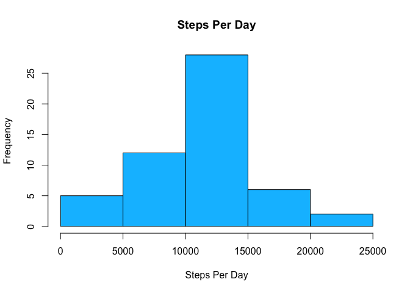
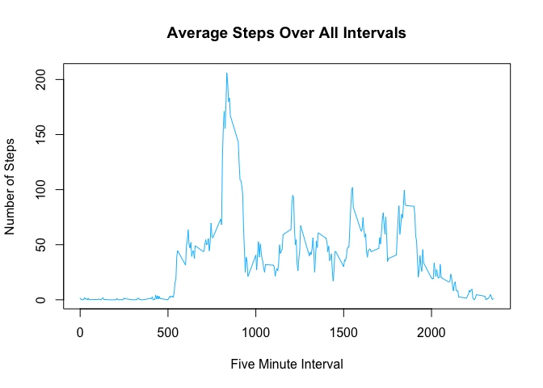
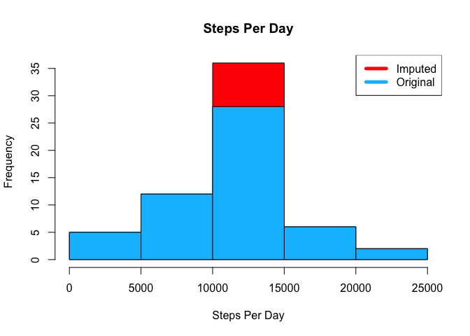
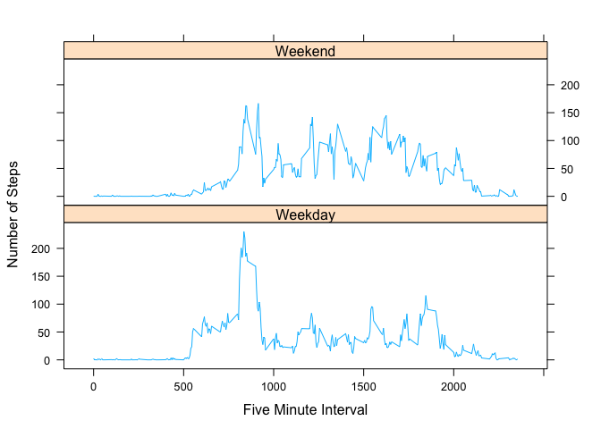

# Reproducible Research: Peer Assessment 1

## Loading and preprocessing the data

Ensure activity file is in current working directory.


```r
activityFile = 'activity.zip'
if (!activityFile %in% dir()) 
  stop(paste("Could not find ", activityFile, " in ", getwd()))
```
  
Read activity file as a CSV.


```r
activityCSV <- unzip(activityFile)
activityDF <- read.csv(activityCSV, colClasses=c('integer', 'Date', 'integer'))
```

## What is mean total number of steps taken per day?

Calculate the total number of steps taken per day.


```r
totalStepsPerDay <- aggregate(steps ~ date, data=activityDF, sum, na.rm=T)
```

Make a histogram of the total number of steps taken each day.


```r
hist(totalStepsPerDay$steps, main='Steps Per Day', xlab='Steps Per Day', col='deepskyblue')
```



Calculate and report the mean and median of the total number of steps taken per day.


```r
mean(totalStepsPerDay$steps)
```

```
## [1] 10766.19
```

```r
median(totalStepsPerDay$steps)
```

```
## [1] 10765
```

## What is the average daily activity pattern?

Make a time series plot of the 5-minute interval (x-axis) and the average number of steps taken, averaged across all days (y-axis).


```r
meanStepsPerInterval <- aggregate(steps ~ interval, data=activityDF, mean, na.rm=T)
plot(
  steps ~ interval, 
  data=meanStepsPerInterval, 
  type='l', 
  main='Average Steps Over All Intervals',
  xlab='Five Minute Interval',
  ylab='Number of Steps',
  col='deepskyblue'
)
```



Which 5-minute interval, on average across all the days in the dataset, contains the maximum number of steps?


```r
intervalWithGreatestSteps <- which.max(meanStepsPerInterval$steps)
intervalWithGreatestSteps <- meanStepsPerInterval[intervalWithGreatestSteps, ]
intervalWithGreatestSteps$interval
```

```
## [1] 835
```

The total number of steps was pretty high!


```r
intervalWithGreatestSteps$steps
```

```
## [1] 206.1698
```

They must have gone for a run! :)

## Imputing missing values

Calculate and report the total number of missing values in the dataset (i.e. the total number of rows with NAs).


```r
sum(!complete.cases(activityDF))
```

```
## [1] 2304
```

NAs represent 13.11% of data.


```r
sum(!complete.cases(activityDF)) / length(activityDF$steps) * 100
```

```
## [1] 13.11475
```

Devise a strategy for filling in all of the missing values in the dataset. The strategy does not need to be sophisticated. For example, you could use the mean/median for that day, or the mean for that 5-minute interval, etc.

We choose to impute the mean for any given interval into missing values.

Create a new dataset that is equal to the original dataset but with the missing data filled in.


```r
activityDFI <- as.data.frame(activityDF)
nCC <- !complete.cases(activityDFI)
for (interval in unique(activityDFI$interval)) {
  activityDFI[activityDFI$interval == interval & nCC, ]$steps <-
    meanStepsPerInterval[meanStepsPerInterval$interval == interval, ]$steps
}
```

Make a histogram of the total number of steps taken each day and Calculate and report the mean and median total number of steps taken per day. Do these values differ from the estimates from the first part of the assignment? What is the impact of imputing missing data on the estimates of the total daily number of steps?


```r
totalStepsPerDayI <- aggregate(steps ~ date, data=activityDFI, sum, na.rm=T)
hist(
  totalStepsPerDayI$steps, 
  main='Steps Per Day', 
  xlab='Steps Per Day', 
  col='red'
)
hist(
  totalStepsPerDay$steps,
  col='deepskyblue',
  add=T
)
legend('topright', c('Imputed', 'Original'), col=c('red', 'deepskyblue'), lwd=5)
```



The total number of steps is now much larger, since we've imputed those values.


```r
sum(totalStepsPerDay$steps)
```

```
## [1] 570608
```

```r
sum(totalStepsPerDayI$steps)
```

```
## [1] 656737.5
```

Since we imputed the means with the interval means, the means are still the same:


```r
mean(totalStepsPerDay$steps)
```

```
## [1] 10766.19
```

```r
mean(totalStepsPerDayI$steps)
```

```
## [1] 10766.19
```

```r
mean(totalStepsPerDay$steps) == mean(totalStepsPerDayI$steps)
```

```
## [1] TRUE
```

However when we filled in some steps of imputed data the median shifted up slightly:


```r
median(totalStepsPerDay$steps)
```

```
## [1] 10765
```

```r
median(totalStepsPerDayI$steps)
```

```
## [1] 10766.19
```

```r
median(totalStepsPerDay$steps) == median(totalStepsPerDayI$steps)
```

```
## [1] FALSE
```

## Are there differences in activity patterns between weekdays and weekends?

Create a new factor variable in the dataset with two levels – “weekday” and “weekend” indicating whether a given date is a weekday or weekend day.


```r
activityDFI$partOfWeek <- 
  factor(weekdays(activityDFI$date) %in% c('Saturday', 'Sunday'), labels=c('Weekday', 'Weekend'))
```
  
Make a panel plot containing a time series plot of the 5-minute interval (x-axis) and the average number of steps taken, averaged across all weekday days or weekend days (y-axis). See the README file in the GitHub repository to see an example of what this plot should look like using simulated data.


```r
stepsGivenIntervalAndPartOfWeek <-
  aggregate(steps ~ interval + partOfWeek, data=activityDFI, mean)
library(lattice)
xyplot(
  steps ~ interval | partOfWeek, 
  data=stepsGivenIntervalAndPartOfWeek, 
  type='l',
  layout=c(1, 2),
  xlab='Five Minute Interval',
  ylab='Number of Steps',
  col='deepskyblue',
  pch=20
)
```


